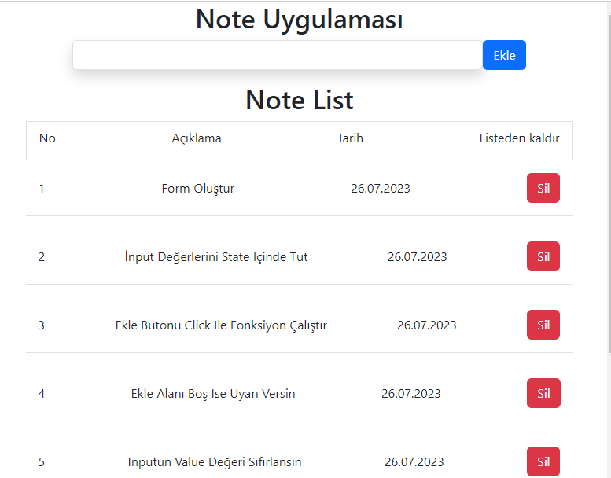

### React Project 5
# Note App

## Note Uygulaması Udemig Ödev projesidir...
- Görevler
- Bütün kodlar app.js'de yazılsın

- Form Oluşturun
- - inputun içeresine yazılan değer state'de tutulmalı `text`
- - useState yardımyla bütün notlar bir dizi halinde tutulmalı `notes[]`
- - Ekle butonuna tıklanılınca ekleme fonk. çalışsın
- - Fonksiyon: text state 'inde tuttuğunuz değeri diğer notların yanında göndersin
- - `text` değeri boş ise ekleme fonksiyonu çalışmasın ve alert versin
- - inputu temizleyin (value unutulmasın)

- Note'ların Listeleneceği bir `ul ` oluşturun
- - `notes` dizisindeki her bir eleman içerini `li` basın ve note'un değerini girin (map)

## Preview

# Getting Started with Create React App

This project was bootstrapped with [Create React App](https://github.com/facebook/create-react-app).

## Available Scripts

In the project directory, you can run:

### `npm start`

Runs the app in the development mode.\
Open [http://localhost:3000](http://localhost:3000) to view it in your browser.

# app
# Note-App-React-Project5
# Note-App-React-Project5
# Note-App-React-Project5
# Note-App
